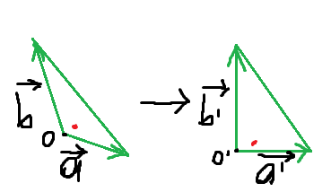

# Eye control

Eye control is a project that allows you to use your gaze to move mouse cursor.

## Requierements

* python>=3.6
* Tensorflow 2
* dlib
* openCV
* pillow (PIL)
* numpy
* matplotlib
* tkinter
* Jupyter notebook (if you want to train your NN yourself)

## Running the watcher

At the start of the program you have to calibrate it.

1. Run calibration_pic in fullscreen. If your screen isnt 1920x1080 then draw calibration pic 
yourself or wait for future versions.

2. Run the program.

Next step you have to do with **fixed head position**, dont move your head etc.

3. Concentrate your view on the point for 5-10 seconds without closing your eyes then 
press the button. Repeat this with all points.

4. Use the program.

**If you move the camera or the screen then you have to restart the program**

## Gaze vector estimation

[GazeML](https://github.com/swook/GazeML) is used for 3d gaze vector estimation. 

## Algorithms

#### Getting face position


dlib is used to detect 2d face landmarks on a picture. Then a 
Perspective-n-Point problem is solved with with the 2d face landmarks and an average 3d
face model. The results are head rotation and translation vectors in 3d world coordinate
system.

#### Averaging
To increase the accuracy of the system, averaging is done.
Current gaze vectors and head positions are calculated as an average of N last estimated values.

### Calibration

The main idea of calibration is to find screen plane in 3d world coordinate system and the
relation between 3d world gaze point and pixel on screen. It is implied that
the user doesnt move his head at all during calibration.

#### Finding screen plane


Red are gaze vectors from left eye, blue - from right eye.
Here you can see the perfect scenario of calibration where all gaze vectors from eyes do cross.
The user has to look to 5 targets(all corners and center of screen). 

Unfortunately, there are no perfect tools that predict gazes or head position without error,
so we cannot guarantee that gaze vectors from 2 eyes to one point cross.

My solution is to estimate a point that has the smallest equal distances to gaze vectors from both eyes. 
Then based on the 5 resulting 3d points(for each corner and center) it is easy to find the plane with 
least squares(remember that the points are not exactly matching real screen points).

The following picture shows the points and estimated screen borders with green.


#### Finding relation between 3d world gaze point and pixel on screen 


On the left is the screen in world coordinate system with red dot be estimated cross 
point of gazes and the screen plane, on the right pixel screen.

The basic idea is to split the 3d screen and pixel screen into four triangles and match
them. 

It is easy to find to which triangle on 3d screen the red point belongs.



Two vectors-sides a and b and point O of 3d screen triangle a form coordinate system in 2d space 
of screen plane. The red point has coordinates ```(c, d)``` in aOb, c and d can be easily calculated. 
The red dot has the same coordinates ```(c, d)``` in ```a'O'b'``` coordinate system so the 
red dot pixel can be found by ```O' + c*a' + d*b'```.

The process that is described can be executed using matrix. During calibration
the matrix for each triangle pair is evaluated.

### Finding gaze target


## Special thanks

*  yinguobing for pnp solve module from [Head pose estimation project](https://github.com/yinguobing/head-pose-estimation) 
*  swook for [GazeML](https://github.com/swook/GazeML)
*  OpenFace for [3d average face model](https://github.com/TadasBaltrusaitis/OpenFace/blob/master/lib/local/LandmarkDetector/model/pdms/In-the-wild_aligned_PDM_68.txt)